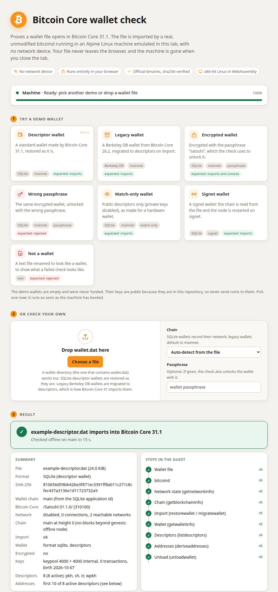
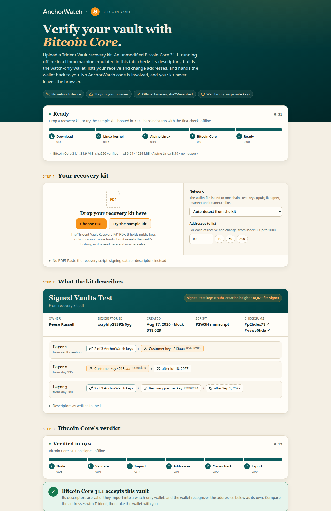
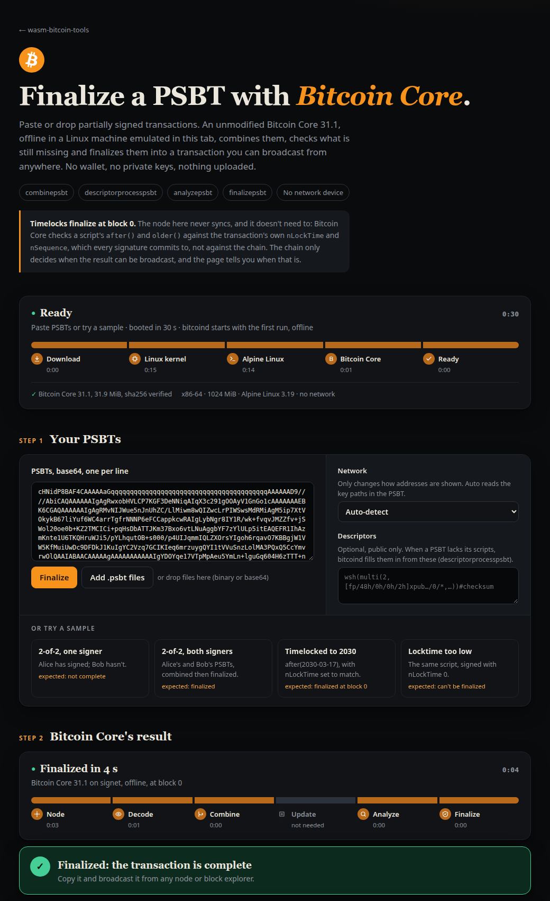

# wasm-bitcoin-tools

Bitcoin tools that run an unmodified Bitcoin Core in your browser. Each page boots Alpine Linux
headlessly (no display, no network device) in [v86_64](https://github.com/portlandhodl/v86_64),
an x86-64 emulator in WebAssembly. It then runs the official x86_64 Bitcoin Core in it with
networking disabled, and drives it over the serial console. Files reach the machine through a
virtio 9p share in the page, and results come back the same way. Nothing is uploaded.

**Try it: <https://portlandhodl.github.io/wasm-bitcoin-tools/>**

| Bitcoin Core wallet check | AnchorWatch vault recovery check | PSBT finalizer |
|---|---|---|
|  |  |  |
| Descriptor demo wallet restored and listed in 15 s | Sample kit validated and imported as a watch-only wallet in 19 s | Two signers' PSBTs combined and finalized in 4 s |

## Table of Contents
- [Purpose](#purpose)
	- [Main Features](#main-features)
	- [Requirements](#requirements)
	- [Usage](#usage)
- [Tools](#tools)
- [Layout](#layout)
- [Running it locally](#running-it-locally)
- [Adding a tool](#adding-a-tool)
- [License](#license)

## Purpose
wasm-bitcoin-tools aims to let anyone check wallets, recovery kits and transactions against the
real Bitcoin Core, without installing it, syncing a node or trusting a third-party service.

### Main Features
**Can check the following**
- Bitcoin Core wallet files (`wallet.dat`): SQLite descriptor wallets restored as they are,
  Berkeley DB legacy wallets migrated to descriptors, encrypted wallets unlocked with a passphrase
- AnchorWatch Trident Vault recovery kits (PDF), turned into a watch-only wallet you can download
- PSBTs from one or more signers, combined, analyzed and finalized, including timelocked spends

**Runs with**
- The official Bitcoin Core 31.1 release binaries, sha256-verified, unmodified
- A 64-bit Alpine Linux guest with no network device: the node never connects anywhere
- Everything in the browser tab: files stay on your machine, and the machine is gone when you
  close the tab

**Can be used**
- Hosted, on GitHub Pages, to try the tools out
- Offline, as a single ~117 MB HTML file per tool, opened straight from disk on an air-gapped
  computer

### Requirements
- A recent desktop browser with WebAssembly
- Memory for the emulated machine, which has 1024 MiB

### Usage
1. Open a tool from the [directory](https://portlandhodl.github.io/wasm-bitcoin-tools/), or
   download its single-file version from the
   [offline release](https://github.com/portlandhodl/wasm-bitcoin-tools/releases/tag/offline).
2. Opened from anywhere but a local file, the page asks you to type a number to show you read
   its safety notice.
3. The machine boots in about 30 seconds. Then drop in a file, or run one of the demos or
   samples.

Note: the hosted pages are for trying the tools out. For anything that matters, take the
single-file version, audit it, and open it on an air-gapped computer. **Never use real bitcoins.**

## Tools

| Tool | What it does |
|---|---|
| [apps/bitcoin-wallet-check.html](apps/bitcoin-wallet-check.html) | Imports a `wallet.dat` (SQLite restored, Berkeley DB migrated), optionally unlocks it, and lists its descriptors and addresses. Demo wallets in [apps/bitcoin-wallets/](apps/bitcoin-wallets/) run with one click. |
| [apps/anchorwatch-recovery.html](apps/anchorwatch-recovery.html) | Reads an AnchorWatch Trident Vault recovery kit (PDF) and has Bitcoin Core validate its descriptors, create the watch-only wallet, list the receive and change addresses and back up the wallet for download. |
| [apps/psbt-finalizer.html](apps/psbt-finalizer.html) | Combines PSBTs from several signers, fills in scripts from public descriptors, reports what each input still needs and finalizes them with `finalizepsbt`, on a wallet-less node at block 0. Timelocked spends finalize too: `after()`/`older()` are checked against the transaction's own `nLockTime`/`nSequence`. Samples in [apps/psbt-samples/](apps/psbt-samples/). |

## Layout

- `v86_64/`: the emulator, as a git submodule. `scripts/setup.sh` builds
  `v86_64/build/libv86.js` and `v86_64/build/v86.wasm` from it. The pages load it, its BIOS
  and its icons from `../v86_64/`.
- `apps/`: the tools, one HTML page each, with their own files next to them.
- `images/` (not in git): the Alpine guest and Bitcoin Core with its glibc runtime, staged
  by `scripts/stage-alpine.sh` and `scripts/stage-bitcoin.sh`.
- `site/og-*.html`: the link preview cards (1200x630), rendered to `site/og-*.png` by
  `scripts/render-og.sh`; `site/site.json` says which page uses which.
- `index.html`: the directory of the tools. Its cards, and each page's link preview, come
  from [site/site.json](site/site.json).
- `scripts/build-site.mjs`: assembles the GitHub Pages site in `_site/`, with the same
  layout. [.github/workflows/pages.yml](.github/workflows/pages.yml) runs it on every
  push to master.
- `scripts/build-offline.mjs`: builds the single-file version of each tool in `_offline/`
  (~117 MB each), with the emulator, Alpine, Bitcoin Core and the samples inline, so it runs
  from `file://` with nothing to fetch. The same workflow attaches them, with `SHA256SUMS`,
  to the `offline` release.

## Running it locally

    git clone --recurse-submodules https://github.com/portlandhodl/wasm-bitcoin-tools
    cd wasm-bitcoin-tools
    ./scripts/setup.sh          # emulator, Alpine 3.19 virt (downloaded, sha256-checked), Bitcoin Core 31.1
    ./scripts/serve.sh          # http://localhost:8000/

The emulator build needs Node.js, Rust with the `wasm32-unknown-unknown` target and clang
(see [v86_64's Readme](https://github.com/portlandhodl/v86_64)). Bitcoin Core's staging copies
the glibc loader and libraries from the host, so it needs x86_64 glibc Linux. Have an Alpine
ISO already? Pass it with `./scripts/setup.sh path/to/alpine-virt-3.19.9-x86_64.iso`.

To move to a newer emulator, update the submodule (`git -C v86_64 pull`), run `./scripts/setup.sh`,
check the pages, and commit the new submodule commit.

## Adding a tool

Put the page in `apps/`, loading the emulator from `../v86_64/` and the images from `../images/`
as the existing pages do. Then add an entry to `apps` in `site/site.json` with its name, tagline,
icon, tags, link preview and the extra `files` it fetches. The directory and the Pages build
pick it up from there.

## License

Everything in this repository is [MIT](LICENSE)-licensed: the pages, scripts, site and link
preview cards, and the demo wallets and sample PSBTs. What it builds on keeps its own license:

- `v86_64/` (the emulator, a submodule): the v86 contributors' BSD 2-Clause license; see
  [v86_64/LICENSE](https://github.com/portlandhodl/v86_64/blob/master/LICENSE).
- Bitcoin Core: MIT. Alpine Linux and the glibc runtime are GPL/LGPL. These are downloaded
  from their official releases by the staging scripts and are not in this repository; the
  published site serves them unmodified.
- The AnchorWatch name and wordmark are AnchorWatch's trademarks, used to identify the
  recovery kits the check reads. The MIT license covers the code, not the marks.
